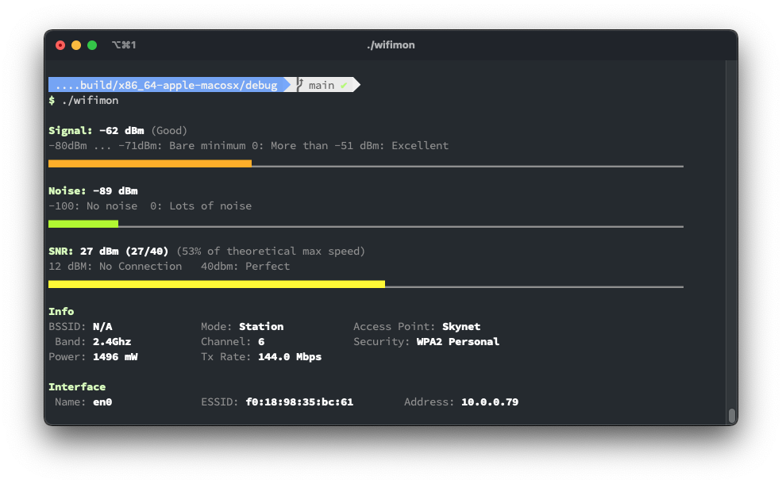

# 📡 wifimon

### Synopsis
`wifimon` is a wireless device monitoring terminal application that allows you to watch signal, noise and SNR levels as well as device configuration and network parameters of your wireless network hardware.

### Platform
`wifimon` currently works on macOS only

### Installation
You can install `wifimon` via Homebrew:
`$ brew install attheodo/formulae/wifimon`

### Usage
`$ wifimon`

### Known limitations / Issues
- [ ] `CoreWLAN` currently has an issue properly reporting BSSID for wireless radio and access point
- [ ] Resizing the terminal (smaller) will probably start jacking up the output. Future versions need to capture the terminal size through `ConsoleKit` and adjust progress bar sizing (character count)

### Future Improvements
- [ ] Use moving averages for Noise / SNR. RSSI probably already reported as a moving average from the chipset

